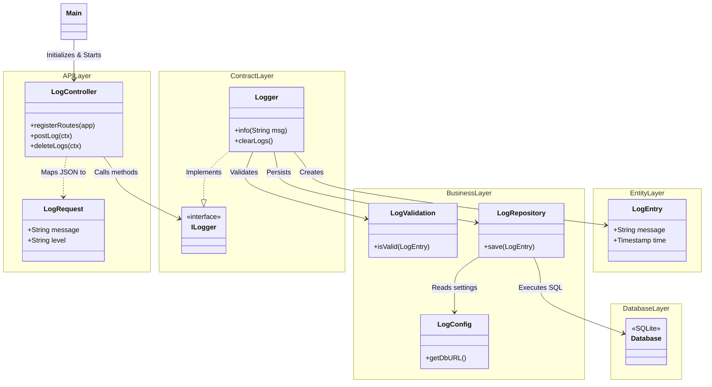

```mermaid
    classDiagram
    %% Entry Point
    Main --> LogController : Initializes & Starts
    
    %% API Layer
    LogController --> ILogger : Calls methods
    LogController ..> LogRequest : Maps JSON to
    
    %% Contract Layer
    Logger ..|> ILogger : Implements
    
    %% Business/Logic Layer
    Logger --> LogEntry : Creates
    Logger --> LogValidation : Validates
    Logger --> LogRepository : Persists
    
    LogRepository --> LogConfig : Reads settings
    LogRepository --> Database : Executes SQL

    namespace APILayer {
        class LogController { 
            +registerRoutes(app)
            +postLog(ctx)
            +deleteLogs(ctx)
        }
        class LogRequest {
            +String message
            +String level
        }
    }

    namespace ContractLayer {
        class ILogger { <<interface>> }
        class Logger { 
            +info(String msg)
            +clearLogs()
        }
    }

    namespace BusinessLayer {
        class LogValidation { +isValid(LogEntry) }
        class LogRepository { +save(LogEntry) }
        class LogConfig { +getDbURL() }
    }

    namespace EntityLayer {
        class LogEntry { 
            +String message
            +Timestamp time
        }
    }

    namespace DatabaseLayer {
        class Database { <<SQLite>> }
    }

```