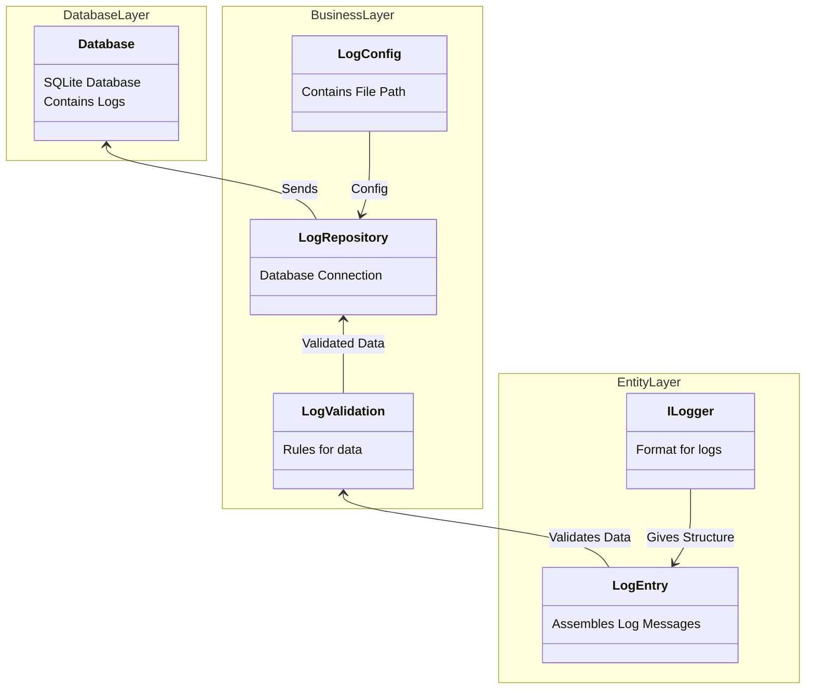

```mermaid
    classDiagram

    %% --- Relationships ---

    Database <-- LogRepository : Sends

    LogRepository <-- LogValidation : Validated Data

    LogConfig --> LogRepository : Config 

    LogValidation <-- LogEntry : Validates Data

    ILogger --> LogEntry : Gives Structure

    namespace DatabaseLayer {
        class Database {
            SQLite Database
            Contains Logs
        }
    }

    namespace BusinessLayer {
        class LogRepository {
            Database Connection
        }

        class LogConfig {
            Contains File Path 
        }

        class LogValidation {
            Rules for data
        }
    }

    namespace EntityLayer {
        class LogEntry {
            Assembles Log Messages
        }

        class ILogger {
            Format for logs
        }
    }

```