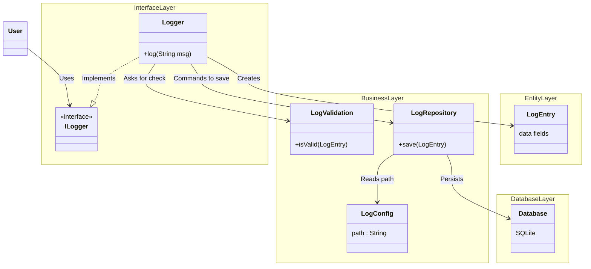

```mermaid
    classDiagram
    %% Användaren ser bara ILogger/Logger
    User --> ILogger : Uses

    %% Logger styr de andra delarna
    Logger ..|> ILogger : Implements
    Logger --> LogEntry : Creates
    Logger --> LogValidation : Asks for check
    Logger --> LogRepository : Commands to save

    %% Business logic
    LogRepository --> Database : Persists
    LogRepository --> LogConfig : Reads path

    namespace InterfaceLayer {
        class ILogger { <<interface>> }
        class Logger { +log(String msg) }
    }

    namespace BusinessLayer {
        class LogValidation { +isValid(LogEntry) }
        class LogRepository { +save(LogEntry) }
        class LogConfig { path : String }
    }

    namespace EntityLayer {
        class LogEntry { data fields }
    }

    namespace DatabaseLayer {
        class Database { SQLite }
    }

```