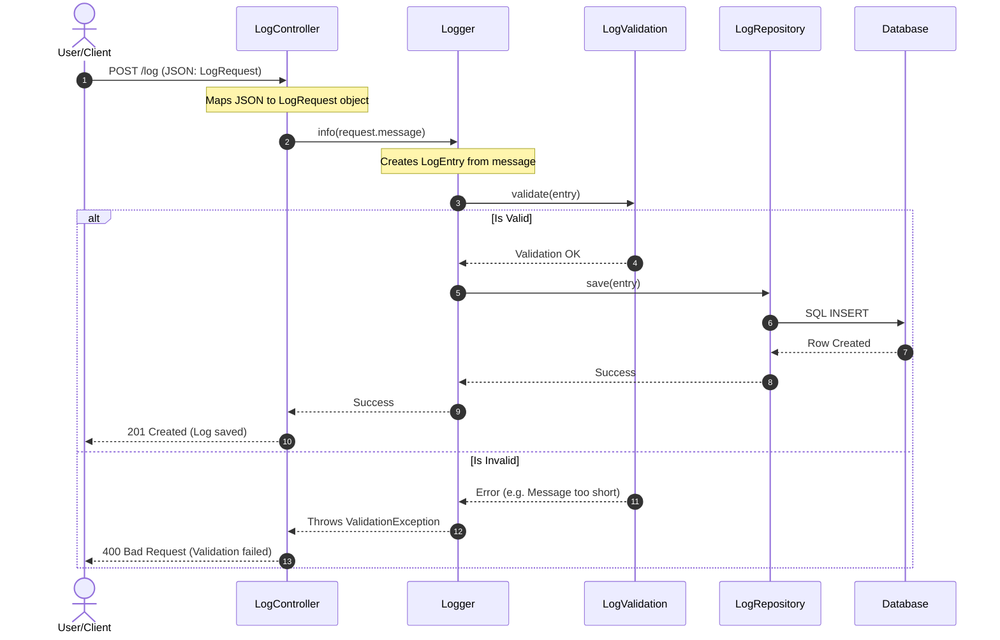

```mermaid
  sequenceDiagram
    autonumber
    actor U as User/Client
    participant C as LogController
    participant L as Logger
    participant V as LogValidation
    participant R as LogRepository
    participant DB as Database

    U->>C: POST /log (JSON: LogRequest)
    Note over C: Maps JSON to LogRequest object
    
    C->>L: info(request.message)
    
    Note over L: Creates LogEntry from message
    L->>V: validate(entry)
    
    alt Is Valid
        V-->>L: Validation OK
        L->>R: save(entry)
        R->>DB: SQL INSERT
        DB-->>R: Row Created
        R-->>L: Success
        L-->>C: Success
        C-->>U: 201 Created (Log saved)
    else Is Invalid
        V-->>L: Error (e.g. Message too short)
        L-->>C: Throws ValidationException
        C-->>U: 400 Bad Request (Validation failed)
    end
```