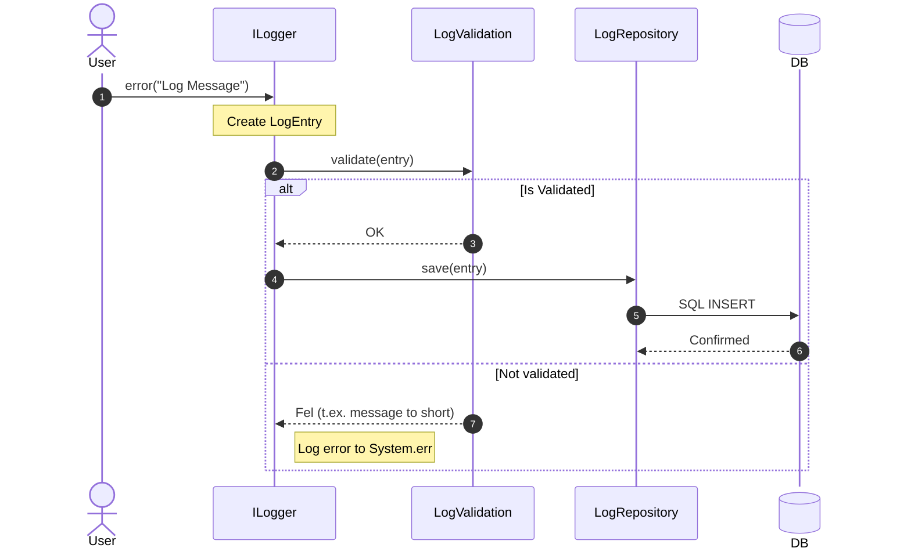

```mermaid
    sequenceDiagram
    autonumber
    actor U as User
    participant L as ILogger
    participant V as LogValidation
    participant R as LogRepository
    participant DB@{ "type" : "database" }

    U->>L: error("Log Message")
    Note over L: Create LogEntry
    L->>V: validate(entry)
    
    alt Is Validated
        V-->>L: OK
        L->>R: save(entry)
        R->>DB: SQL INSERT
        DB-->>R: Confirmed
    else Not validated
        V-->>L: Fel (t.ex. message to short)
        Note right of L: Log error to System.err
    end

```